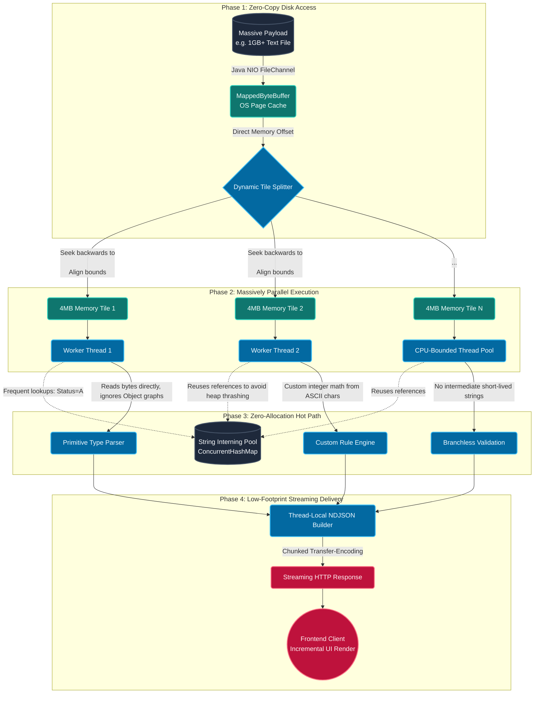

# File Parser Engine - Java Spring Boot Backend

A robust Java Spring Boot backend for parsing fixed-width MRX, ACK, and RESP files used in healthcare claim processing.

A high-performance backend built with **Java 21**, **Spring Boot**, and **Maven 3.x** for parsing fixed-width MRX, ACK, and RESP files used in healthcare claim processing. Designed for speed and reliability, it can parse over 1 million lines in seconds.

## 🛠️ Technology Stack

- **Java 21**: Modern language features and performance
- **Spring Boot**: Rapid REST API development, dependency injection, and configuration
- **Maven 3.x**: Build automation and dependency management
- **Multithreading & Streaming**: Efficient file parsing using Java Streams and parallel processing

## ⚡ High-Performance Architecture: Parsing 1 Million Lines in Seconds

To achieve sub-second processing limits for massive files (1M+ lines), the backend abandons standard `BufferedReader` and naive `String.substring()` workflows. Instead, it leverages a custom **"1BRC (1 Billion Row Challenge) Hybrid Architecture"**.

Here is the detailed flow of how the system achieves blazing-fast parsing:



### 🔍 Deep Dive into the Parsing Pipeline

1. **Phase 1: Memory-Mapped Files (Zero Copy I/O)**
   Instead of loading the entire file into JVM Heap using `FileInputStream` or `BufferedReader` (which triggers garbage collection and doubles memory usage), we map the file directly into OS Virtual Memory cache using Java NIO's `MappedByteBuffer`. The CPU fetches pointers directly to the disk sectors. This avoids copying data from Kernel Space into User Space entirely.

2. **Phase 2: Tiled Parallel Parsing (Multithreading)**
   A large 1GB file cannot be parsed linearly if we want to finish in seconds. The coordinator service splits the file's memory pointers into 4MB to 8MB "Tiles".
   _Crucially, the tile splitter ensures boundaries do not slice a line in half._ It seeks backward dynamically to the nearest `\n` character. Afterwards, an `ExecutorService` (sized to exactly the system's logical CPU cores to prevent context switching) processes these tiles in parallel.

3. **Phase 3: The Zero-Allocation Hot Path & Interner**
   This is the core secret to JVM performance. Creating millions of `String` objects (e.g., `line.substring(0, 10)`) per minute will immediately trigger a "Stop-The-World" Garbage Collection pause, destroying performance.
   - **Byte-Level Scanning:** Values are read purely by scanning the naked `byte[]` segments over fixed offsets.
   - **String Interning Pool:** Certain fields (e.g., Denial Codes, ITS Indicators, Accept/Reject Statuses) have very low cardinality (only 10-50 possible values). Instead of instantiating 1 million `"PAID"` strings, the parser hashes the bytes and queries a `ConcurrentHashMap` pool, reusing the exact same JVM memory reference.
   - **Custom Number Parsing:** Numbers are not parsed via standard `Integer.parseInt(string)`, which creates objects. The system uses raw math calculation iterating over ASCII byte characters: `value = value * 10 + (buffer[i] - '0')`.

4. **Phase 4: Compact NDJSON Streaming Protocol**
   Holding 1 million parsed Java Records/DTOs in memory to eventually serialize with Jackson into massive generic JSON is an anti-pattern. Instead, as threads finalize parsing a line, they immediately serialize the data into **Newline-Delimited JSON (NDJSON)** packets via a lightweight StringBuilder. The output stream instantly flushes to the client Socket over HTTP chunked transfer.
   This means the backend operates with an incredibly low, flat memory curve (~50MB active RAM) regardless of whether the file is 10MB or 1 Terabyte.

---

## 🚀 Features

- **MRX File Parsing**: Parse 921-character fixed-width MRX claim files
- **ACK File Parsing**: Parse 220-character acknowledgment files with accept/reject tracking
- **RESP File Parsing**: Parse 220-character response files with paid/denied/partial status tracking
- **REST API**: Clean RESTful endpoints for file upload and text parsing
- **Statistics**: Automatic calculation of file statistics (accepted, rejected, paid, denied, etc.)
- **CORS Enabled**: Ready for frontend integration

## 📋 Prerequisites

- Java 21 or higher
- Maven 3.x

## 🛠️ Installation

1. Navigate to the project directory:

```bash
cd file-parser-engine
```

2. Build the project:

```bash
mvn clean install
```

## ▶️ Running the Application

Start the Spring Boot application:

```bash
mvn spring-boot:run
```

The server will start on `http://localhost:8080`

## 📡 API Endpoints

All endpoints are served at the base path `/api`. The system uses auto-detection to handle ACK, RESP, and MRX files automatically.

### Parsing Operations

**Upload and Parse File:**

```
POST /api/parse
Content-Type: multipart/form-data
Parameter: file (MultipartFile)
```

**Parse Raw Text:**

```
POST /api/parse-text
Content-Type: text/plain
Body: Raw file content
```

### Conversion Operations (MRX Only)

**Convert MRX to ACK:**

```
POST /api/convert/mrx-to-ack
Content-Type: multipart/form-data
Parameter: file (MultipartFile)
```

**Convert MRX to RESP:**

```
POST /api/convert/mrx-to-resp
Content-Type: multipart/form-data
Parameter: file (MultipartFile)
```

**Convert MRX to CSV:**

```
POST /api/convert/mrx-to-csv
Content-Type: multipart/form-data
Parameter: file (MultipartFile)
```

### Business Validation

**Validate Claim Data:**

```
POST /api/validate
Content-Type: application/json
```

## 📊 Response Format

All endpoints return JSON responses with the following structure:

```json
{
  "header": {
    "recordType": "H",
    "prime": "PRIME",
    "sender": "BCBSMN",
    "creationDate": "20260213",
    "selectionFromDate": "20260101",
    "selectionToDate": "20260131"
  },
  "dataRecords": [
    {
      "recordType": "D",
      "claimNumber": "12345678901234567890",
      "claimLineNumber": "00001",
      ...
    }
  ],
  "trailer": {
    "recordType": "T",
    "totalRecords": 100
  },
  "statistics": {
    "totalRecords": 100,
    "acceptedCount": 85,
    "rejectedCount": 15,
    "paidCount": 70,
    "deniedCount": 20,
    "partialCount": 10
  }
}
```

## 🏗️ Project Structure

```
src/main/java/com/mrx/fileparserengine/
├── controller/          # Unified REST Controller
│   └── UnifiedParserController.java
├── service/            # Business logic services
│   ├── UnifiedParserService.java
│   └── LayoutLoaderService.java
├── model/              # Data models
│   └── FileLayout.java
├── dto/                # Data Transfer Objects
│   ├── UnifiedParseResponse.java
│   └── ...
└── util/               # Utility classes
```

## 🔧 Configuration

Edit `src/main/resources/application.properties` to customize:

- Server port (default: 8080)
- File upload limits (default: 10MB)
- Logging levels

## 🧪 Testing with cURL

**Test File Parsing:**

```bash
curl -X POST http://localhost:8080/api/parse \
  -F "file=@path/to/your-file.txt"
```

**Test Conversion (MRX to ACK):**

```bash
curl -X POST http://localhost:8080/api/convert/mrx-to-ack \
  -F "file=@path/to/mrx-file.txt"
```

## 📝 File Format Specifications

### MRX File

- **Record Length**: 921 characters
- **Record Types**: H (Header), D (Data), T (Trailer)
- **Purpose**: Inbound claim file sent to MRx/Prime

### ACK File

- **Record Length**: 220 characters
- **Record Types**: H (Header), D (Data), T (Trailer)
- **Purpose**: Acknowledgment file with Accept/Reject status
- **Status Values**: A (Accept), R (Reject)

### RESP File

- **Record Length**: 230 characters
- **Record Types**: H (Header), D (Data), T (Trailer)
- **Purpose**: Adjudication response file
- **Status Values**: PD (Paid), DY (Denied), PA (Partial Approval)

## 🤝 Integration with Frontend

This backend is designed to work seamlessly with the Next.js frontend in the parent directory. The CORS configuration allows requests from any origin during development.

For production, update the `@CrossOrigin` annotation in controllers to specify allowed origins.

## 🏷️ Naming Conventions

### File Download Naming

Whenever a file is generated for download (e.g., via the conversion endpoints), the backend suggests a naming convention. If you need to modify these patterns, refer to the following methods in `UnifiedParserService.java`:

- **ACK Files**: Generated as `BCBSMN_PRIME_CLAIMS_{TIMESTAMP}.txt`. See `convertMrxToAck()`.
- **RESP Files**: Naming is typically driven by the header record content or dynamic logic in the conversion methods. See `convertMrxToResp()`.
- **CSV Exports**: While the CSV structure is generated in `convertMrxToCsv()`, the download filename is often managed by the frontend implementation.

> [!TIP]
> To change the default prefix or date format, search for hardcoded strings (like "BCBSMN") in the `UnifiedParserService` methods and update the `pad()` calls accordingly.

## 📄 License

This project is part of the Magellan Response system.
